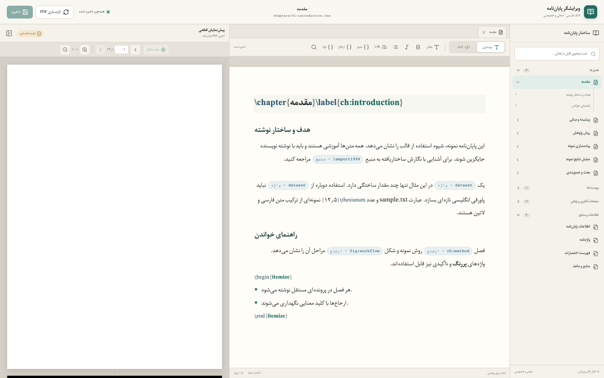
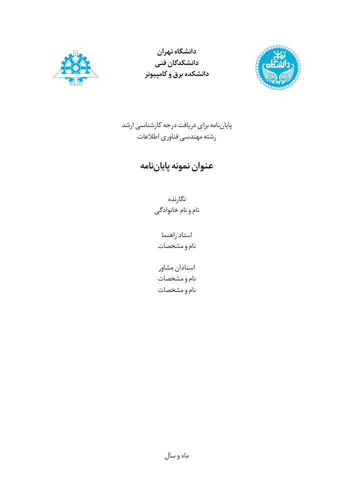
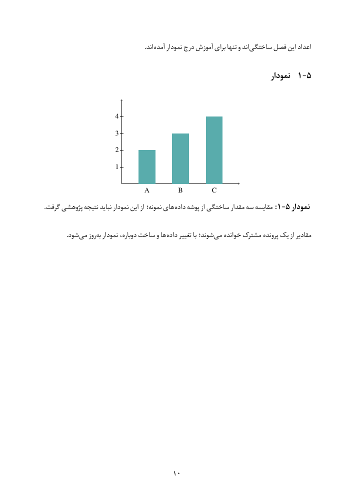
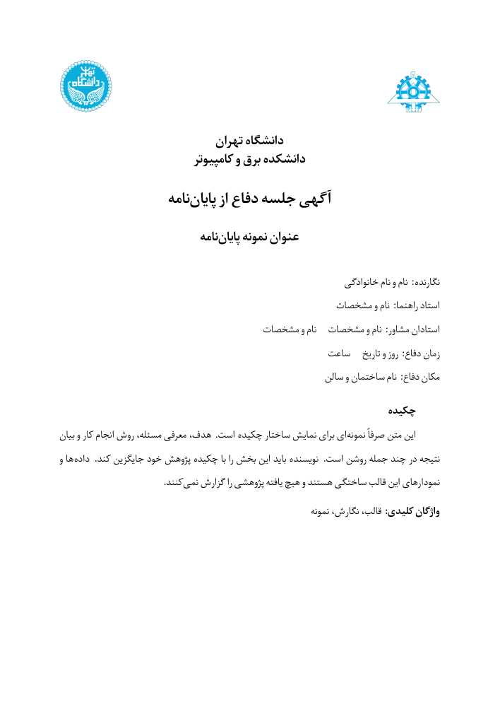

# University of Tehran Thesis Kit

A local workspace for writing a Persian thesis: a university-formatted LaTeX template, an RTL editor with PDF preview, and a matching defense announcement. The included text, figures, and data are neutral examples ready to replace with your own work.



## What’s included

| Folder | Purpose |
|---|---|
| `thesis-latex` | Six sample chapters, appendices, front matter, metadata, bibliography, and terminology |
| `latex-local-editor` | Persian visual/source editor, search, completion, explicit saves, and conflict handling |
| `figures` | Shared university logos and editable sample diagrams/charts |
| `experiment_results` | Clearly labeled synthetic data used by the examples |
| `defense-poster-template` | Defense announcement sharing the thesis title, names, abstract, fonts, and logos |
| `presentation` | Empty starting point for a future presentation |

## Template preview

| Thesis cover | Sample chart page | Defense announcement |
|:---:|:---:|:---:|
|  |  |  |

[View the sample thesis PDF](sample-output/sample-thesis.pdf) · [View the poster PDF](sample-output/sample-defense-poster.pdf)

## Main features

- **Persian and English together:** RTL editing, bundled IRNazanin and TeX Gyre Termes fonts, and English closing pages.
- **Structured writing:** chapter-by-chapter files, citations, cross-references, first-use terminology footnotes, and generated glossary/acronym lists.
- **Publication elements:** short/long captions, shared figure/chart numbering, multipage tables, equations, and landscape pages.
- **Local PDF workflow:** preview unsaved tabs in an isolated copy; use SyncTeX to find the cursor’s PDF location. Saving remains explicit.
- **Portable setup:** Docker Compose bundles the editor and TeX toolchain; native installation is also supported.

## Start

```sh
docker compose up --build -d
```

Open [localhost:5185](http://127.0.0.1:5185), then edit the metadata and chapters. See the [Persian-first guide](README.md) for authoring and PDF build commands, and the [verification report](VERIFICATION.md) for tested platforms and limitations.

The template retains uniform **25 mm margins**; check your faculty’s current rules. The independent editor/tooling is **MIT**, the derived template/poster **GPL-3.0**, and fonts retain their own licenses. No acknowledgment in your thesis is requested.
